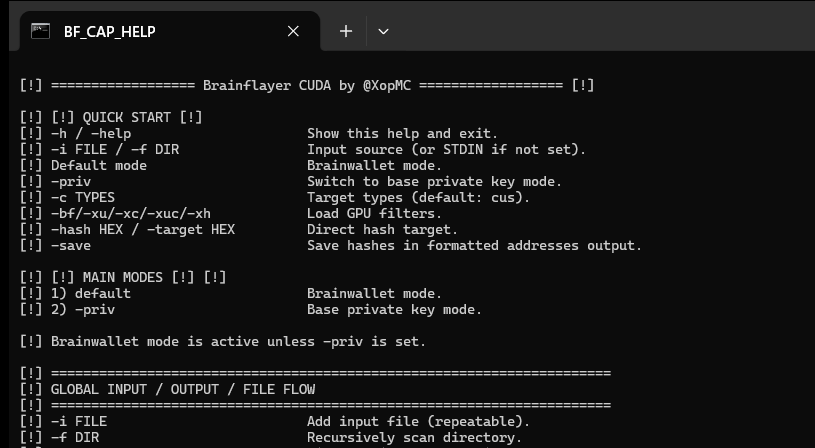
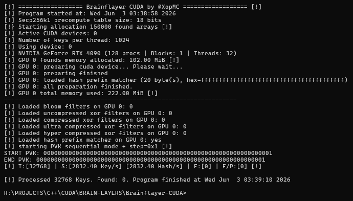
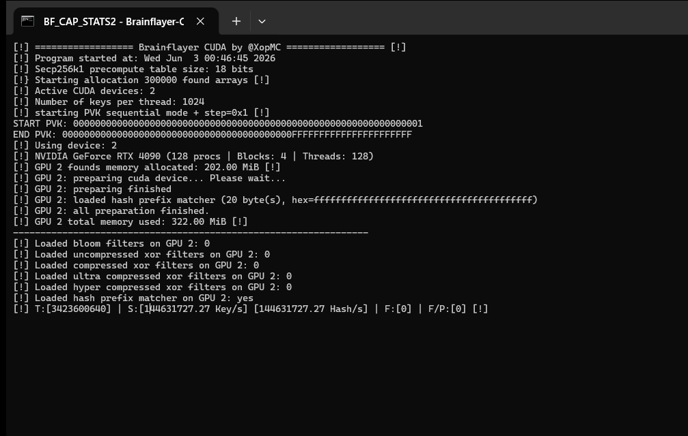
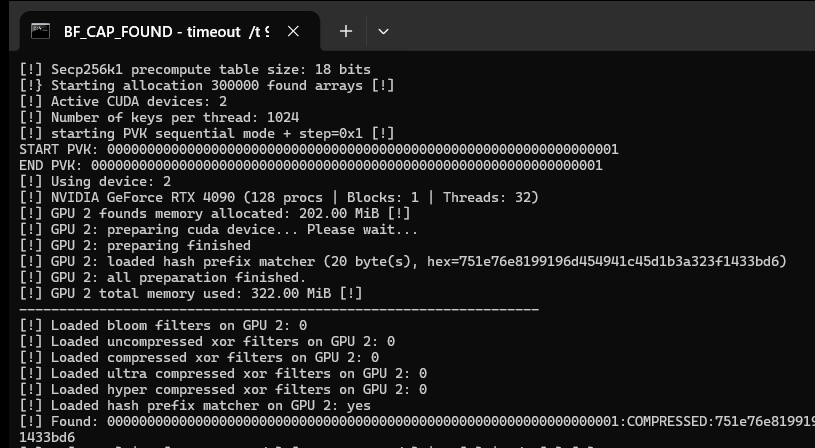

<p align="center">
  <a href="#english"><strong>English</strong></a> |
  <a href="#russian"><strong>Русский</strong></a>
</p>

<a id="english"></a>

# brainflayer-CUDA

Author: Mikhail Khoroshavin, also known as `XopMC`

`brainflayer-CUDA` is a CUDA program for checking brainwallet candidates and base private keys against cryptocurrency targets.

The program has two public modes:

- *brainwallet mode* is enabled by default;
- `-priv` switches to base private-key mode.

This release is intentionally focused on the parts that are useful in real audit and wallet-restoration work: file and stream input, sequential ranges, GPU mask generation, Bloom and XOR filters, exact hash targets, multi-GPU runs, live speed output, and address saving.

## Important Notice

This project is provided only for security research, testing, and restoring wallets that belong to you or that you are explicitly authorized to check.

You are fully responsible for how you use this software. The author is not responsible for losses, damage, legal claims, or misuse caused by running this program. The product is provided *as is*.

## Screenshots

**Help screen.** Shows the main CLI sections: default brainwallet mode, `-priv`, input sources, filters, targets, save mode, and GPU parameters.

<p>
  
</p>

**Startup and GPU preparation.** Shows CUDA device selection, blocks and threads, hash matcher loading, filters, and sequential range output.

<p>
  
</p>

**Speed and live statistics.** Shows full-grid `-priv -c c` sequential speed on GPU 0, without manual `-b` / `-t` limits.

<p>
  
</p>

**Found test result.** Shows a deterministic private key `1` hit for the compressed BTC hash160 test target.

<p>
  
</p>

## What This Program Does

The program takes candidates, derives selected target families, and compares the results with filters or exact hash targets.

Candidate sources can be:

- text lines from `stdin`;
- files with `-i`;
- directories with `-f`;
- sequential ranges with `-start` and `-end`;
- random generated values with `-random`;
- brainwallet masks created on the GPU with `-mask` or `-mask-file`.

Search targets can be:

- GPU Bloom filters;
- GPU XOR filters;
- CPU-side Bloom/XOR verification after a GPU hit;
- direct `-hash` / `-target` values for tests and small exact checks.

When `-save` is enabled, found hashes are written as formatted cryptocurrency addresses for the selected target family. Without `-save`, the program prints the matched hash payload.

## Download Builds

Release `v1.0.0` contains two ready-to-run archives:

- `brainflayer-CUDA-v1.0.0-windows-x64-cuda12.8.zip`
- `brainflayer-CUDA-v1.0.0-linux-x64-cuda12.8.tar.gz`

Download page:

```text
https://github.com/XopMC/brainflayer-CUDA/releases/tag/v1.0.0
```

The release builds are made with CUDA `12.8` and include these CUDA architectures:

```text
sm_61, sm_75, sm_86, sm_89, sm_120
```

## Building From Source

### Windows

Install Visual Studio and CUDA Toolkit `12.8`.

```powershell
msbuild Brainflayer-CUDA.sln /p:Configuration=Release /p:Platform=x64
```

The binary will be created here:

```text
x64\Release\Brainflayer-CUDA.exe
```

### Linux

Install CUDA Toolkit `12.8`, GCC, G++, and Make.

```bash
make CUDA_PATH=/usr/local/cuda-12.8
```

The binary will be created here:

```text
bin/Brainflayer-CUDA
```

## Quick Start

### Brainwallets From A File

Brainwallet mode is the default mode. No mode flag is required.

```powershell
Brainflayer-CUDA.exe -i brain.txt -c cus -bf targets.blf -save -o found.txt
```

Where:

- `-i brain.txt` reads one candidate per line;
- `-c cus` checks compressed, uncompressed, and SegWit BTC-style targets;
- `-bf targets.blf` loads a Bloom filter on the GPU;
- `-save` writes found results as addresses;
- `-o found.txt` changes the output file.

### Brainwallets From Another Generator

If no input file is selected, the program reads `stdin`.

```powershell
type brain.txt | Brainflayer-CUDA.exe -c c -bf targets.blf -save
```

Or with another generator:

```powershell
Generator.exe | Brainflayer-CUDA.exe -sha256 -iter 1,2,4 -c c -bf targets.blf
```

### Direct Hash Test

Use `-hash` for deterministic tests or a small exact target.

```powershell
Brainflayer-CUDA.exe -priv -start 1 -end 1 -device 0 -c c -hash 751e76e8199196d454941c45d1b3a323f1433bd6
```

This example checks private key `1` against the compressed BTC hash160.

## Command Line Arguments

### Global Input And Output

```text
-h, -help        Show help.
-i FILE          Read candidates from a file. Can be repeated.
-f DIR           Recursively scan a directory.
-all             With -f: include all files, not only .txt files.
-delete          Delete input files after processing.
-o FILE          Output file. Default: result.txt.
-save            Save found hashes as formatted addresses.
-silent          Do not print found lines to console.
-hex             Decode each input line from hex before processing.
```

`-silent` only hides found lines in the console. It does not disable `-save`, startup messages, speed output, or final statistics.

### GPU Selection And Geometry

```text
-device LIST     CUDA device list: 0, 0,1,3, or 0-3.
-b N             Override block count.
-t N             Override threads per block.
```

For normal work, do not set `-b` and `-t` unless you are tuning. The release defaults use the full GPU geometry selected by the program. Small values such as `-b 1 -t 32` are useful only for short tests and screenshots, not for speed.

Examples:

```powershell
Brainflayer-CUDA.exe -i brain.txt -device 0 -c c -bf targets.blf
Brainflayer-CUDA.exe -i brain.txt -device 0,1,3 -c cus -bf targets.blf -save
Brainflayer-CUDA.exe -priv -start 1 -end ffffffff -device 0-3 -c c -hash HASH
```

## Brainwallet Mode

Brainwallet mode is active by default.

Each input candidate is hashed and then interpreted as key material for target derivation.

Supported hash modes:

```text
-sha256          SHA-256 brain hash. Default.
-sha3            SHA3-256 brain hash.
-keccak          Keccak-256 brain hash.
-blake2b         BLAKE2b-256 brain hash.
-raw             Use input bytes as the 32-byte scalar.
-iter LIST       Iteration list, for example 1,4,6-10.
```

Only one hash mode can be active at a time.

`-iter` accepts comma-separated values and ranges:

```powershell
Brainflayer-CUDA.exe -i brain.txt -sha256 -iter 1,4,6-10 -c c -bf targets.blf
```

For `-raw`, only effective iteration `1` is valid. Use it only when the input bytes are already the scalar you want to check.

### Hex Input In Brainwallet Mode

With `-hex`, every input line is decoded as hexadecimal bytes before hashing.

```powershell
Brainflayer-CUDA.exe -hex -i hex_brain.txt -sha256 -c u -bf targets.blf -save
```

Without `-hex`, the line is used as normal text.

## Private-Key Mode

`-priv` switches the program to base private-key mode.

```powershell
Brainflayer-CUDA.exe -priv -hex -i keys.txt -c c -bf targets.blf
```

In this mode, input candidates are private keys, not brainwallet strings.

`-priv` supports:

- `stdin`;
- `-i FILE`;
- `-f DIR`;
- `-hex`;
- sequential ranges;
- random private keys.

### Fast Sequential secp256k1 Path

Sequential `-priv` scans use optimized CUDA kernels. For pure secp256k1 target sets, the program can use specialized kernels instead of the generic multi-curve path.

In this mode private keys are generated on the GPU. The CPU sends the range parameters and receives found results; it does not upload one private key per candidate. This is the right mode for large private-key ranges.

Typical fast cases:

```powershell
Brainflayer-CUDA.exe -priv -start 1 -end ffffffffffff -c c -bf btc_compressed.blf
Brainflayer-CUDA.exe -priv -start 1 -end ffffffffffff -c u -bf btc_uncompressed.blf
Brainflayer-CUDA.exe -priv -start 1 -end ffffffffffff -c s -bf segwit.blf
Brainflayer-CUDA.exe -priv -start 1 -end ffffffffffff -c r -bf taproot.blf
Brainflayer-CUDA.exe -priv -start 1 -end ffffffffffff -c e -bf eth.blf
Brainflayer-CUDA.exe -priv -start 1 -end ffffffffffff -c x -bf xpoint.blf
```

If you mix secp256k1 targets with ed25519, sr25519, TON, DOT, ICP, or other non-secp256k1 families, the program uses the compatible generic path.

For maximum speed, select only the target letters you actually need. `-c c` is less work than `-c cus`, and `-c cus` is less work than a broad multi-family target set.

For maximum speed, also leave `-b` and `-t` unset. The release build selects the tuned full grid automatically. Use small manual grids only for short correctness tests.

## Sequential Mode

Sequential mode works in both default brainwallet mode and `-priv` mode.

```text
-start VALUE     Start point. Enables sequential mode.
-end VALUE       End point.
-step VALUE      Step. Default: 1.
-back            Scan backward.
-both            Scan both directions around start. Requires -n.
-random          Random branch inside the selected range. Use with -n.
-n N             Candidate limit.
```

For `-priv`, values are 256-bit private-key numbers and are printed as 64 hex characters.

For default brainwallet mode, values are 2048-bit brain points and are printed as 512 hex characters.

Short values are left-padded with zeros.

Examples:

```powershell
Brainflayer-CUDA.exe -priv -start 1 -end ffffff -step 1 -c c -hash HASH
Brainflayer-CUDA.exe -priv -start ffffff -end 1 -back -step 1 -c c -bf targets.blf
Brainflayer-CUDA.exe -start 1 -end ffff -sha256 -iter 1,2,4 -c c -bf targets.blf
```

With several GPUs, generated ranges are split across selected devices. The program does not make every GPU repeat the same range.

```powershell
Brainflayer-CUDA.exe -priv -start 1 -end ffffffffffffffff -device 0,1 -c c -bf targets.blf
```

For `-priv`, each selected GPU receives a different private-key subsequence. With `-step 1 -device 0,1`, GPU 0 starts from `start`, GPU 1 starts from `start + 1`, and the effective per-GPU step becomes `2`.

## Mask Brute Mode

Mask mode is a brainwallet candidate source. It creates candidates directly on the GPU, then applies the selected brainwallet hash, iteration list, filters, and target types.

This is important for speed: the CPU does not generate every candidate string and push it to the GPU one by one.

```powershell
Brainflayer-CUDA.exe -mask pass?d?d?d -sha256 -c c -bf targets.blf
```

Mask tokens:

```text
?l               abcdefghijklmnopqrstuvwxyz
?u               ABCDEFGHIJKLMNOPQRSTUVWXYZ
?d               0123456789
?h               0123456789abcdef
?H               0123456789ABCDEF
?s               Space and ASCII symbols
?a               Printable ASCII 0x20..0x7e
??               Literal question mark
?1 ?2 ?3 ?4      Custom charsets from -cs1, -cs2, -cs3, -cs4
```

Custom charset example:

```powershell
Brainflayer-CUDA.exe -cs1 abcDEF123 -mask key?1?1?1?1 -sha256 -c u -hash HASH
```

Several masks can be passed directly:

```powershell
Brainflayer-CUDA.exe -mask admin?d?d -mask pass?d?d?d -sha256 -c c -bf targets.blf
```

Or from a file:

```powershell
Brainflayer-CUDA.exe -mask-file masks.txt -sha256 -iter 1,2,4 -c cus -bf targets.blf -save
```

`-n` limits the total number of generated candidates:

```powershell
Brainflayer-CUDA.exe -mask ?l?l?l?l?d?d -n 1000000 -c c -bf targets.blf
```

With several GPUs, mask candidate ordinals are split across selected devices.

```powershell
Brainflayer-CUDA.exe -mask ?d?d?d?d?d?d?d?d -device 0,1 -c c -bf targets.blf
```

## Filters And Direct Targets

GPU filters:

```text
-bf PATH         Bloom filter.
-xc PATH         XOR filter for compressed targets.
-xu PATH         XOR filter for uncompressed targets.
-xuc PATH        Ultra-compressed XOR filter.
-xh PATH         Hyper-compressed XOR filter.
```

CPU verification filters:

```text
-xx PATH         CPU XOR check for uncompressed targets.
-xb PATH         CPU Bloom check.
```

Direct target:

```text
-hash HEX        Direct hash target. 1..20 bytes, 2..40 hex chars.
-target HEX      Alias for -hash.
```

Examples:

```powershell
Brainflayer-CUDA.exe -i brain.txt -c c -bf btc.blf
Brainflayer-CUDA.exe -i brain.txt -c cu -xc compressed.xc -xu uncompressed.xu
Brainflayer-CUDA.exe -i brain.txt -c u -xu uncompressed.xu -xx full_uncompressed.xu
Brainflayer-CUDA.exe -priv -start 1 -end ffffff -c c -hash 751e76e8199196d454941c45d1b3a323f1433bd6
```

Use CPU post-checks when you need extra verification after a GPU-side hit. They add CPU work, so they are not a free speed feature.

### Bloom Filters

`brainflayer-CUDA` accepts Bloom filters compatible with the formats used by [brainflayer](https://github.com/ryancdotorg/brainflayer) and [Mnemonic_CPP](https://github.com/XopMC/Mnemonic_CPP).

You can load several Bloom filters by repeating `-bf`:

```powershell
Brainflayer-CUDA.exe -i brain.txt -bf wallet_a.blf -bf wallet_b.blf -c c
```

### XOR Filters And XorFilter

Create XOR filters with [XorFilter](https://github.com/XopMC/XorFilter), then load them directly into `brainflayer-CUDA`.

Recommended workflow:

- `.xor_u` is the only XOR format recommended as a final standalone filter without extra CPU confirmation.
- `.xor_c`, `.xor_uc`, and `.xor_hc` are compact GPU prefilters. They save GPU memory and are useful for broad scans, but they should be confirmed by a full `.xor_u` CPU check.
- For `.xor_c`, `.xor_uc`, and `.xor_hc`, add `-xx wallet.xor_u` so GPU survivors are rechecked on the CPU against an uncompressed `.xor_u` filter.
- Several XOR filters of the same family can be loaded by repeating the corresponding flag.

Practical example:

```powershell
Brainflayer-CUDA.exe -i brain.txt -xc wallet.xor_c -xx wallet.xor_u -c cus
```

Multi-filter example:

```powershell
Brainflayer-CUDA.exe -i brain.txt -xc wallet_a.xor_c -xc wallet_b.xor_c -xx wallet_master.xor_u -c cus
```

For private-key ranges the same filter flow works with `-priv`:

```powershell
Brainflayer-CUDA.exe -priv -start START -end END -xc wallet.xor_c -xx wallet.xor_u -c c
```

This pattern gives a compact GPU filter at the front and a precise CPU re-check at the end.

## Target Types

`-c` selects which target families are calculated and checked. Several letters can be used together:

```powershell
Brainflayer-CUDA.exe -i brain.txt -c cusex -bf targets.blf
```

Supported letters:

| Letter | Target family |
| --- | --- |
| `c` | BTC compressed hash160 |
| `u` | BTC uncompressed hash160 |
| `s` | BTC SegWit hash160 |
| `r` | BTC Taproot hash |
| `e` | Ethereum address |
| `x` | secp256k1 public-key X coordinate |
| `t` | TON popular variants |
| `T` | TON all variants |
| `S` | Solana |
| `d` | DOT, ed25519 and sr25519 |
| `f` | Filecoin |
| `i` | IOTA, ed25519 and secp256k1 |
| `A` | Aptos |
| `U` | SUI |
| `X` | XRP |
| `I` | ICP |
| `Z` | XTZ |

Default target set:

```text
cus
```

## Saving Results

Without `-save`, found lines contain the matched hash payload.

With `-save`, found results are written as formatted addresses for the selected target type.

```powershell
Brainflayer-CUDA.exe -i brain.txt -c cus -bf targets.blf -save -o found.txt
```

`-silent` hides found lines in the console but still writes to the output file:

```powershell
Brainflayer-CUDA.exe -i brain.txt -c c -bf targets.blf -save -silent -o found.txt
```

For multi-GPU runs, all devices write through the shared output path. The save layer uses asynchronous queues and flushes before shutdown.

## Performance Notes

For real runs:

- use the Release build;
- use a current NVIDIA driver compatible with CUDA `12.8`;
- avoid small `-b` / `-t` values unless you are testing;
- select only required target families with `-c`;
- prefer generated ranges or GPU masks when the candidate space is naturally generated;
- use `-silent` during long sessions if console output becomes a bottleneck;
- keep input files on a fast disk when feeding huge candidate lists;
- use GPU filters for the main search and CPU post-checks only when you need the extra verification.

When checking only compressed secp256k1 targets from a private-key range, the usual high-speed form is:

```powershell
Brainflayer-CUDA.exe -priv -start START -end END -device 0,1 -c c -bf btc_compressed.blf -save -silent -o found.txt
```

## Donation

If this project helped you, you can support development:

```text
ETH:    0xDE85c1Ef7874A1D94578f11332e8fa9A6a0eE853
BTC:    bc1q063pks7ex93eka56zyumvutdt6zs9dj959pe9p
LTC:    ltc1qysumht4lxafwvmcu4ruxzuztc2xmj8tz986fmm
TRX:    TTZ3oL16BVNzU46MSJvaoKYAhvtwdTUcnz
TON:    UQC7eqLN_NlVz82YzsjzAo4iOzKjH3t095-CMtqTJ5aoqo0l
DOT:    1jen89F5v6TbdQsRaKxsCqhNp9qAdeHeZyEUWjgrM8mW6hs
DASH:   Xms41jaD967XMf2FAfEwGUxYKKhYQuok9T
SOLANA: BvDQDEgq3kbNT7VQFQRQPjc4Ta5k7d5s7GdcgoKnq3KG
```

---

<a id="russian"></a>

# brainflayer-CUDA

Автор: Михаил Хорошавин, также известен как `XopMC`

`brainflayer-CUDA` - это программа на CUDA для проверки кандидатов brainwallet и обычных приватов / приватных ключей по криптовалютным целям.

В публичной версии есть два режима:

- *brainwallet* включен по умолчанию;
- `-priv` включает режим обычных приватов / приватных ключей.

В релизе оставлено только то, что нужно для практической работы: файлы и поток ввода, последовательные диапазоны, перебор по маске на видеокарте, Bloom и XOR фильтры, точная проверка по хешу, несколько видеокарт, живая статистика скорости и сохранение адресов.

## Важное предупреждение

Проект предназначен только для исследования безопасности, тестирования и восстановления кошельков, которые принадлежат вам или на проверку которых у вас есть явное разрешение.

Вся ответственность за использование программы лежит на пользователе. Автор не отвечает за потери, ущерб, претензии, нарушение закона или любое другое последствие использования. Программа предоставляется *как есть*.

## Скриншоты

**Справка по запуску.** Показывает основные разделы командной строки: режим brainwallet по умолчанию, `-priv`, источники ввода, фильтры, цели, сохранение и параметры видеокарт.

<p>
  
</p>

**Запуск и подготовка видеокарты.** Видно выбранную CUDA-карту, блоки и потоки, загрузку точной цели, фильтры и вывод границ последовательного диапазона.

<p>
  
</p>

**Скорость и живая статистика.** Полная сетка для `-priv -c c` на GPU 0, без ручного ограничения через `-b` / `-t`.

<p>
  
</p>

**Тестовое найденное совпадение.** Проверочный запуск, где приватный ключ `1` дает совпадение по compressed BTC hash160.

<p>
  
</p>

## Что делает программа

Программа получает кандидаты, считает выбранные типы целей и сравнивает результат с фильтрами или точным хешем.

Источники кандидатов:

- строки из стандартного ввода;
- файлы через `-i`;
- папки через `-f`;
- последовательные диапазоны через `-start` и `-end`;
- случайные значения через `-random`;
- маски brainwallet, которые генерируются прямо на видеокарте через `-mask` или `-mask-file`.

Цели поиска:

- Bloom фильтры на видеокарте;
- XOR фильтры на видеокарте;
- дополнительная проверка Bloom/XOR на процессоре после совпадения на видеокарте;
- прямые значения `-hash` / `-target` для тестов и точечной проверки.

С флагом `-save` найденные хеши сохраняются как адреса выбранных валют. Без `-save` программа выводит найденный хеш.

## Готовые сборки

В релизе `v1.0.0` есть два архива:

- `brainflayer-CUDA-v1.0.0-windows-x64-cuda12.8.zip`
- `brainflayer-CUDA-v1.0.0-linux-x64-cuda12.8.tar.gz`

Страница загрузки:

```text
https://github.com/XopMC/brainflayer-CUDA/releases/tag/v1.0.0
```

Сборки сделаны на CUDA `12.8` и включают такие архитектуры CUDA:

```text
sm_61, sm_75, sm_86, sm_89, sm_120
```

## Сборка из исходников

### Windows

Нужно установить Visual Studio и CUDA Toolkit `12.8`.

```powershell
msbuild Brainflayer-CUDA.sln /p:Configuration=Release /p:Platform=x64
```

Готовый файл будет здесь:

```text
x64\Release\Brainflayer-CUDA.exe
```

### Linux

Нужно установить CUDA Toolkit `12.8`, GCC, G++ и Make.

```bash
make CUDA_PATH=/usr/local/cuda-12.8
```

Готовый файл будет здесь:

```text
bin/Brainflayer-CUDA
```

## Быстрый запуск

### Brainwallet из файла

Режим brainwallet включен по умолчанию. Отдельный флаг режима не нужен.

```powershell
Brainflayer-CUDA.exe -i brain.txt -c cus -bf targets.blf -save -o found.txt
```

Где:

- `-i brain.txt` читает по одному кандидату на строку;
- `-c cus` проверяет compressed, uncompressed и SegWit цели;
- `-bf targets.blf` загружает Bloom фильтр на видеокарту;
- `-save` сохраняет найденное в виде адресов;
- `-o found.txt` задает файл результата.

### Brainwallet из другого генератора

Если файл не указан, программа читает стандартный ввод.

```powershell
type brain.txt | Brainflayer-CUDA.exe -c c -bf targets.blf -save
```

Пример со сторонним генератором:

```powershell
Generator.exe | Brainflayer-CUDA.exe -sha256 -iter 1,2,4 -c c -bf targets.blf
```

### Точная проверка по хешу

`-hash` удобно использовать для тестов и проверки небольшого точного набора.

```powershell
Brainflayer-CUDA.exe -priv -start 1 -end 1 -device 0 -c c -hash 751e76e8199196d454941c45d1b3a323f1433bd6
```

Этот пример проверяет приватный ключ `1` по compressed BTC hash160.

## Аргументы запуска

### Ввод и вывод

```text
-h, -help        показать справку
-i FILE          читать кандидаты из файла, можно повторять
-f DIR           рекурсивно читать папку
-all             вместе с -f читать все файлы, не только .txt
-delete          удалять входные файлы после обработки
-o FILE          файл результата, по умолчанию result.txt
-save            сохранять найденные хеши как адреса
-silent          не печатать найденные строки в консоль
-hex             декодировать каждую входную строку из hex
```

`-silent` скрывает только найденные строки. Он не отключает `-save`, стартовые сообщения, скорость и итоговую статистику.

### Видеокарты и сетка запуска

```text
-device LIST     список CUDA устройств: 0, 0,1,3 или 0-3
-b N             вручную задать количество блоков
-t N             вручную задать количество потоков в блоке
```

Для нормальной работы не указывайте `-b` и `-t`, если специально не настраиваете производительность. По умолчанию программа использует полную сетку для выбранной видеокарты. Маленькие значения вроде `-b 1 -t 32` нужны только для коротких тестов.

Примеры:

```powershell
Brainflayer-CUDA.exe -i brain.txt -device 0 -c c -bf targets.blf
Brainflayer-CUDA.exe -i brain.txt -device 0,1,3 -c cus -bf targets.blf -save
Brainflayer-CUDA.exe -priv -start 1 -end ffffffff -device 0-3 -c c -hash HASH
```

## Режим brainwallet

Это основной режим, он включен по умолчанию.

Каждый входной кандидат хешируется выбранным способом, после чего используется как материал для проверки целей.

Способы хеширования:

```text
-sha256          SHA-256, используется по умолчанию
-sha3            SHA3-256
-keccak          Keccak-256
-blake2b         BLAKE2b-256
-raw             использовать входные байты как 32-байтовое число
-iter LIST       список повторов, например 1,4,6-10
```

Одновременно можно выбрать только один способ хеширования.

`-iter` принимает значения и диапазоны через запятую:

```powershell
Brainflayer-CUDA.exe -i brain.txt -sha256 -iter 1,4,6-10 -c c -bf targets.blf
```

Для `-raw` допустим только один проход. Используйте этот режим только если входные байты уже являются числом, которое нужно проверить.

### Hex-ввод в режиме brainwallet

С флагом `-hex` каждая входная строка сначала декодируется как hex, и только потом хешируется.

```powershell
Brainflayer-CUDA.exe -hex -i hex_brain.txt -sha256 -c u -bf targets.blf -save
```

Без `-hex` строка используется как обычный текст.

## Режим приватов / приватных ключей

Флаг `-priv` переключает программу в режим обычных приватов / приватных ключей.

```powershell
Brainflayer-CUDA.exe -priv -hex -i keys.txt -c c -bf targets.blf
```

В этом режиме входные кандидаты являются приватами / приватными ключами, а не строками brainwallet.

`-priv` поддерживает:

- стандартный ввод;
- `-i FILE`;
- `-f DIR`;
- `-hex`;
- последовательные диапазоны;
- случайные приваты / приватные ключи.

### Быстрый последовательный путь для secp256k1

В последовательном режиме `-priv` используются оптимизированные CUDA-ядра. Для чистых secp256k1-целей программа может запускать специализированные ядра вместо общего пути для разных кривых.

В этом режиме приваты генерируются на видеокарте. Процессор передает параметры диапазона и получает найденные результаты; он не отправляет на видеокарту каждый приватный ключ отдельно. Именно этот режим подходит для больших диапазонов приватов / приватных ключей.

Типичные быстрые варианты:

```powershell
Brainflayer-CUDA.exe -priv -start 1 -end ffffffffffff -c c -bf btc_compressed.blf
Brainflayer-CUDA.exe -priv -start 1 -end ffffffffffff -c u -bf btc_uncompressed.blf
Brainflayer-CUDA.exe -priv -start 1 -end ffffffffffff -c s -bf segwit.blf
Brainflayer-CUDA.exe -priv -start 1 -end ffffffffffff -c r -bf taproot.blf
Brainflayer-CUDA.exe -priv -start 1 -end ffffffffffff -c e -bf eth.blf
Brainflayer-CUDA.exe -priv -start 1 -end ffffffffffff -c x -bf xpoint.blf
```

Если смешать secp256k1-цели с ed25519, sr25519, TON, DOT, ICP или другими несовместимыми семействами, будет использован общий совместимый путь.

Для максимальной скорости выбирайте только те буквы `-c`, которые действительно нужны. `-c c` легче, чем `-c cus`, а `-c cus` легче, чем широкий набор разных семейств.

Для максимальной скорости также не задавайте `-b` и `-t`. Релизная сборка сама выбирает настроенную полную сетку запуска. Маленькие ручные значения нужны только для коротких проверок.

## Последовательный перебор

Последовательный перебор работает и в режиме brainwallet, и в режиме `-priv`.

```text
-start VALUE     начало диапазона, включает последовательный режим
-end VALUE       конец диапазона
-step VALUE      шаг, по умолчанию 1
-back            идти назад
-both            идти в обе стороны от start, требует -n
-random          случайные значения внутри диапазона, использовать с -n
-n N             ограничение количества кандидатов
```

Для `-priv` значения являются 256-битными приватами / приватными ключами и печатаются как 64 hex-символа.

Для режима brainwallet значения являются 2048-битными точками и печатаются как 512 hex-символов.

Короткие значения дополняются нулями слева.

Примеры:

```powershell
Brainflayer-CUDA.exe -priv -start 1 -end ffffff -step 1 -c c -hash HASH
Brainflayer-CUDA.exe -priv -start ffffff -end 1 -back -step 1 -c c -bf targets.blf
Brainflayer-CUDA.exe -start 1 -end ffff -sha256 -iter 1,2,4 -c c -bf targets.blf
```

На нескольких видеокартах диапазон делится между выбранными устройствами. Каждая видеокарта получает свою часть, а не повторяет одну и ту же работу.

```powershell
Brainflayer-CUDA.exe -priv -start 1 -end ffffffffffffffff -device 0,1 -c c -bf targets.blf
```

В режиме `-priv` каждая выбранная видеокарта получает свою подпоследовательность приватов / приватных ключей. Например, с `-step 1 -device 0,1` GPU 0 начинает с `start`, GPU 1 начинает с `start + 1`, а эффективный шаг на каждой видеокарте становится `2`.

## Перебор по маске

Маска - это источник кандидатов brainwallet. Кандидаты создаются прямо на видеокарте, после чего к ним применяется выбранное хеширование, список `-iter`, фильтры и типы целей.

Это важно для скорости: процессор не генерирует каждую строку и не передает ее на видеокарту по одной.

```powershell
Brainflayer-CUDA.exe -mask pass?d?d?d -sha256 -c c -bf targets.blf
```

Обозначения в маске:

```text
?l               abcdefghijklmnopqrstuvwxyz
?u               ABCDEFGHIJKLMNOPQRSTUVWXYZ
?d               0123456789
?h               0123456789abcdef
?H               0123456789ABCDEF
?s               пробел и ASCII-символы
?a               все печатные ASCII-символы 0x20..0x7e
??               обычный знак вопроса
?1 ?2 ?3 ?4      свои наборы из -cs1, -cs2, -cs3, -cs4
```

Пример со своим набором символов:

```powershell
Brainflayer-CUDA.exe -cs1 abcDEF123 -mask key?1?1?1?1 -sha256 -c u -hash HASH
```

Можно передать несколько масок:

```powershell
Brainflayer-CUDA.exe -mask admin?d?d -mask pass?d?d?d -sha256 -c c -bf targets.blf
```

Или читать их из файла:

```powershell
Brainflayer-CUDA.exe -mask-file masks.txt -sha256 -iter 1,2,4 -c cus -bf targets.blf -save
```

`-n` ограничивает общее количество сгенерированных кандидатов:

```powershell
Brainflayer-CUDA.exe -mask ?l?l?l?l?d?d -n 1000000 -c c -bf targets.blf
```

На нескольких видеокартах порядковые номера кандидатов маски делятся между выбранными устройствами.

```powershell
Brainflayer-CUDA.exe -mask ?d?d?d?d?d?d?d?d -device 0,1 -c c -bf targets.blf
```

## Фильтры и точные цели

Фильтры на видеокарте:

```text
-bf PATH         Bloom фильтр
-xc PATH         XOR фильтр для compressed
-xu PATH         XOR фильтр для uncompressed
-xuc PATH        ultra-compressed XOR фильтр
-xh PATH         hyper-compressed XOR фильтр
```

Дополнительная проверка на процессоре:

```text
-xx PATH         проверка uncompressed XOR на процессоре
-xb PATH         проверка Bloom на процессоре
```

Точная цель:

```text
-hash HEX        прямое сравнение с хешем, 1..20 байт, 2..40 hex-символов
-target HEX      то же самое, что -hash
```

Примеры:

```powershell
Brainflayer-CUDA.exe -i brain.txt -c c -bf btc.blf
Brainflayer-CUDA.exe -i brain.txt -c cu -xc compressed.xc -xu uncompressed.xu
Brainflayer-CUDA.exe -i brain.txt -c u -xu uncompressed.xu -xx full_uncompressed.xu
Brainflayer-CUDA.exe -priv -start 1 -end ffffff -c c -hash 751e76e8199196d454941c45d1b3a323f1433bd6
```

Проверка на процессоре нужна, когда после совпадения на видеокарте требуется дополнительная проверка. Она добавляет работу процессору, поэтому это не бесплатное ускорение.

### Bloom Фильтры

`brainflayer-CUDA` принимает Bloom-фильтры, совместимые с форматами, которые используют [brainflayer](https://github.com/ryancdotorg/brainflayer) и [Mnemonic_CPP](https://github.com/XopMC/Mnemonic_CPP).

Можно подключать несколько Bloom-фильтров, просто повторяя `-bf`:

```powershell
Brainflayer-CUDA.exe -i brain.txt -bf wallet_a.blf -bf wallet_b.blf -c c
```

### XOR Фильтры И XorFilter

XOR-фильтры создавайте через [XorFilter](https://github.com/XopMC/XorFilter), после этого их можно сразу подключать в `brainflayer-CUDA`.

Рекомендуемая схема:

- `.xor_u` - единственный XOR-формат, который можно использовать как финальный фильтр без дополнительной проверки на процессоре.
- `.xor_c`, `.xor_uc` и `.xor_hc` - компактные предварительные фильтры для видеокарты. Они экономят память видеокарты и удобны для широкого поиска, но их лучше подтверждать полной проверкой `.xor_u` на процессоре.
- Для `.xor_c`, `.xor_uc` и `.xor_hc` добавляйте `-xx wallet.xor_u`, чтобы кандидаты после видеокарты перепроверялись на процессоре по несжатому `.xor_u`.
- Несколько XOR-фильтров одного семейства можно подключать повторением соответствующего флага.

Практический пример:

```powershell
Brainflayer-CUDA.exe -i brain.txt -xc wallet.xor_c -xx wallet.xor_u -c cus
```

Пример с несколькими XOR-фильтрами:

```powershell
Brainflayer-CUDA.exe -i brain.txt -xc wallet_a.xor_c -xc wallet_b.xor_c -xx wallet_master.xor_u -c cus
```

Для диапазонов приватов / приватных ключей схема с фильтрами такая же, только добавляется `-priv`:

```powershell
Brainflayer-CUDA.exe -priv -start START -end END -xc wallet.xor_c -xx wallet.xor_u -c c
```

Такой шаблон дает компактный фильтр на видеокарте на входе и точную проверку на процессоре на выходе.

## Типы целей

`-c` выбирает, какие семейства целей считать и проверять. Несколько букв можно указывать вместе:

```powershell
Brainflayer-CUDA.exe -i brain.txt -c cusex -bf targets.blf
```

Поддерживаемые буквы:

| Буква | Семейство целей |
| --- | --- |
| `c` | BTC, сжатый публичный ключ, hash160 |
| `u` | BTC, несжатый публичный ключ, hash160 |
| `s` | BTC SegWit, hash160 |
| `r` | BTC Taproot, хеш |
| `e` | Ethereum, адрес |
| `x` | координата X публичного ключа secp256k1 |
| `t` | основные варианты TON |
| `T` | все варианты TON |
| `S` | Solana |
| `d` | DOT, ed25519 и sr25519 |
| `f` | Filecoin |
| `i` | IOTA, ed25519 и secp256k1 |
| `A` | Aptos |
| `U` | SUI |
| `X` | XRP |
| `I` | ICP |
| `Z` | XTZ |

По умолчанию используется:

```text
cus
```

## Сохранение результатов

Без `-save` найденная строка содержит найденный хеш.

С `-save` результат сохраняется как адрес для выбранного типа цели.

```powershell
Brainflayer-CUDA.exe -i brain.txt -c cus -bf targets.blf -save -o found.txt
```

`-silent` скрывает найденные строки в консоли, но не мешает записи в файл:

```powershell
Brainflayer-CUDA.exe -i brain.txt -c c -bf targets.blf -save -silent -o found.txt
```

В режиме нескольких видеокарт все устройства пишут в общий файл. Сохранение работает через асинхронные очереди и сбрасывает данные перед завершением.

## Советы по скорости

Для реальной работы:

- используйте Release-сборку;
- используйте драйвер NVIDIA, совместимый с CUDA `12.8`;
- не задавайте маленькие `-b` / `-t`, если это не тест;
- выбирайте только нужные типы целей через `-c`;
- используйте диапазоны или маски на видеокарте, если пространство кандидатов удобно генерировать;
- включайте `-silent` в долгих запусках, если вывод в консоль мешает;
- держите большие входные файлы на быстром диске;
- основной поиск делайте через фильтры на видеокарте, а проверку на процессоре включайте только когда она действительно нужна.

Для быстрой проверки compressed secp256k1 по диапазону приватов / приватных ключей обычная форма запуска такая:

```powershell
Brainflayer-CUDA.exe -priv -start START -end END -device 0,1 -c c -bf btc_compressed.blf -save -silent -o found.txt
```

## Донат

Если проект оказался полезен, можно поддержать разработку:

```text
ETH:    0xDE85c1Ef7874A1D94578f11332e8fa9A6a0eE853
BTC:    bc1q063pks7ex93eka56zyumvutdt6zs9dj959pe9p
LTC:    ltc1qysumht4lxafwvmcu4ruxzuztc2xmj8tz986fmm
TRX:    TTZ3oL16BVNzU46MSJvaoKYAhvtwdTUcnz
TON:    UQC7eqLN_NlVz82YzsjzAo4iOzKjH3t095-CMtqTJ5aoqo0l
DOT:    1jen89F5v6TbdQsRaKxsCqhNp9qAdeHeZyEUWjgrM8mW6hs
DASH:   Xms41jaD967XMf2FAfEwGUxYKKhYQuok9T
SOLANA: BvDQDEgq3kbNT7VQFQRQPjc4Ta5k7d5s7GdcgoKnq3KG
```
